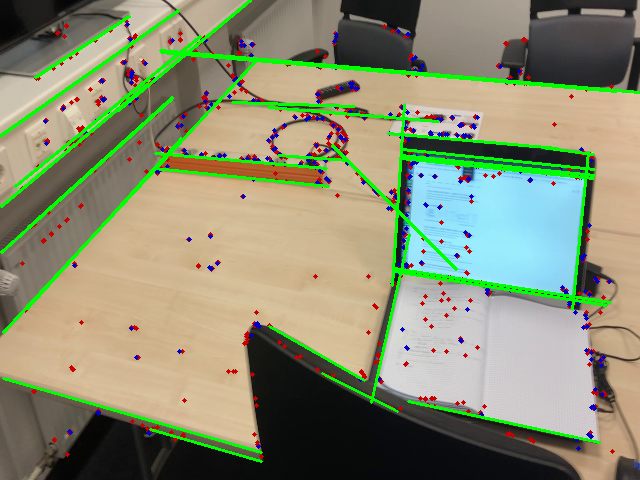
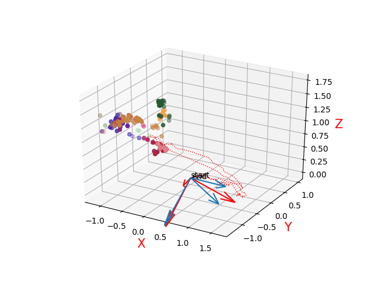
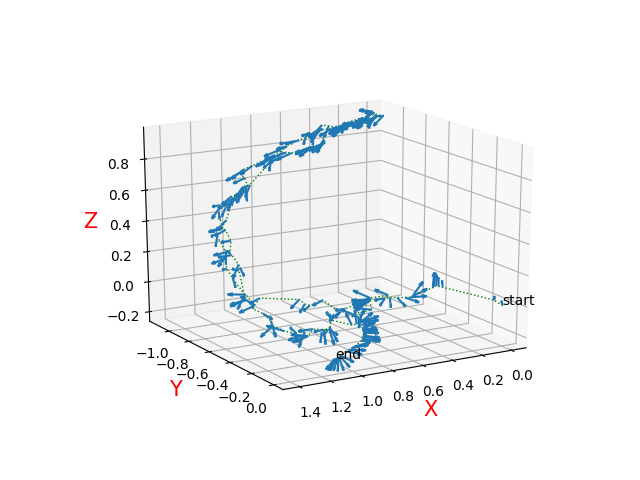

# ORB_SLAM-Analysis

#### This repository consists of several method to analysis or improvment of ORB_SLAM Algorithm.

## Sequence_capture :

This Programm is used to get sequences for ORB_SLAM running from a Video or directly capture frames from laptop's camera. (Mode 1 is for Video cutting and Mode 0 capture frames from camera) \

The Sequences will be saved to the files that ORB_SLAM can directly run, with a sequence and a txt file.

## Hough & World Basis :

Since ORB_SLAM cam't determine the real world-frame and orintation, this is a way to estimate the world-basis from the ORB_SLAM Data(which could e saved with https://github.com/TianlunHu/My-ORB-SLAM ). \

The real world frame could be recoverd if there are enough 3D points' coordinates on the objects that stand vertical or horizontal to the ground. \

In this case, straight lines in every frame of ORB_SLAM could be detected with improved-Hough-Line-Detector. 'improved' means only the key points in frames are taken in count, and also some keypoints near to the line. \

With corespended 3D-mappoints, SVD could be applied to solve the direction that most points indicate. And this could be regard as an estimation od the World-Basis. (The accuracy of this method also depend on how many othogonal lines are detected )

## Trajectory :

This implements a methode to recover the 3D motion trajectory from ORB_SLAM DATA i.e Position Vector, Quaternion or Camera matrix. \

###### !!! The trajectory and orientation are not ground truth !!!

